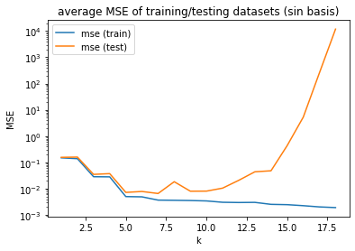
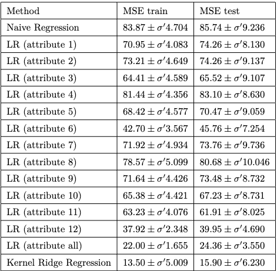
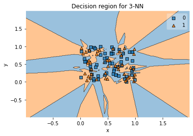
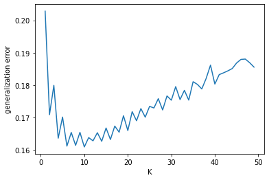
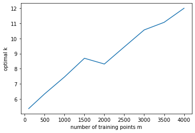
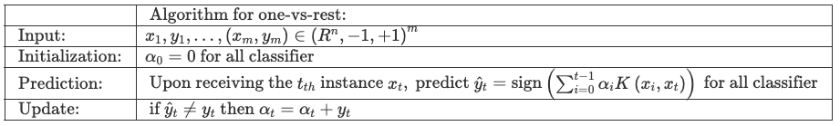
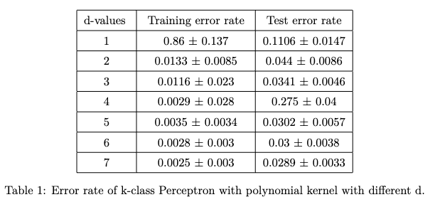
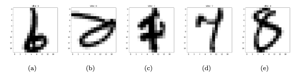
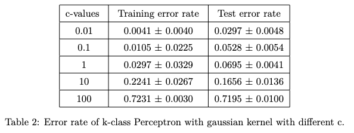

# Supervised Learning
This archive contains the finalized projects completed during the 2022-2023 session of the "[Supervised Learning](https://www.ucl.ac.uk/module-catalogue/modules/supervised-learning-COMP0078)" module. The first coursework talks about linear regression and KNN while the second trained a perceptron to classify handwritten digit numbers.

Following are the brief description of two coursework. See corresponding code and report for more information.
## CW1

### Linear Regression

We first illustrated the phenomena of **overfitting, underfitting** and hyper-parameter with polynomial basis and $sin(k\pi x)$ basis. 

```python
def coef_sin_reg(x, y, k):
    """calculate coefficients of linear regression with a sin(k*pi*x) basis

    Args:
        x (np.ndarray): m*1 vector
        y (np.ndarray): m*1 vector
        k (int): feature map from dim 1 to k
    Returns:
        w (np.ndarray): w = (X'X)^(-1)X'y coefficients of regression
    """
    m = len(x) # number of input x
    assert len(x) == len(y)
    basis_x = np.zeros((m, k))
    for i in range(1, k+1):
        basis_x[:,i-1] = np.sin(i*(np.pi)*x)
    return scipy.linalg.solve(basis_x.T @ basis_x, basis_x.T @ y)
```
<center>
    <div style="display: inline-block;">
        
        <br>
        <div style="color:orange; border-bottom: 1px solid #d9d9d9;
        display: inline-block;
        color: #999;
        padding: 2px;">
            Average test error versus the hyperparameter k in 100 runs in a logarithmic scale
        </div>
    </div>
</center>

### Kernel methods

Then we extended linear regression with kernel method on predict the median house price of [Boston](http://www.cs.toronto.edu/~delve/data/boston/bostonDetail) with one or more attributes.

### kernel Ridge Regression

We Researched KRR with the Gaussian Kernel and performed it on predicting the median house price of [Boston](http://www.cs.toronto.edu/~delve/data/boston/bostonDetail). KRR shows its advance on the nonlinear data set.

$$
K\left(\boldsymbol{x}_i, \boldsymbol{x}_j\right)=\exp \left(-\frac{\left\|\boldsymbol{x}_i-\boldsymbol{x}_j\right\|^2}{2 \sigma^2}\right)
$$

```python
def gaussian_kernel(x_1, x_2, sigma):
    """gaussian kernel of x_1 and x_2

    Args:
        x1 (np.ndarray): shape (m_1, n). m_2 examples, n features
        x2 (np.ndarray): shape (m_2, n). m_2 examples, n features
        sigma (float): parameter

    Returns:
        K : shape (m_1, m_2). Kernel matrix
    """
    assert(x_1.shape[1] == x_2.shape[1])
    K = cdist(x_1, x_2, 'euclidean')
    K = np.exp(-(K ** 2) / (2. * sigma ** 2))
    return K

def train_kernel_ridge(x_train, y_train, sigma, gam):
    """alpha of the ridge regression

    Args:
        x_train (np.ndarray): shape (m, n_1). m examples, n_1 features
        y_train (np.ndarray): shape (m, n_2). m examples, n_2 features
        sigma (float): parameter
        gam (float): parameter

    Returns:
        alpha (np.ndarray): shape (m, n_2).
    """

    K = gaussian_kernel(x_train, x_train, sigma)
    ell = K.shape[0]
    alpha = np.dot(inv(K + gam * ell * np.eye(ell)), y_train)
    return alpha
```
<center>
    <div style="display: inline-block;">
        
        <br>
        <div style="color:orange; border-bottom: 1px solid #d9d9d9;
        display: inline-block;
        color: #999;
        padding: 2px;">
            The train/test error with their standard deviations for four methods.
        </div>
    </div>
</center>


### k-Nearest Neighbors

We implemented the k-NN algorithm and explore its performance as a function of k.

<center>
    <div style="display: inline-block;">
        
        <br>
        <div style="color:orange; border-bottom: 1px solid #d9d9d9;
        display: inline-block;
        color: #999;
        padding: 2px;">
            A visualization of a hypothesis.
        </div>
    </div>
</center>

We estimated generalization error of k-NN as a function of k

<center>
    <div style="display: inline-block;">
        
        <br>
        <div style="color:orange; border-bottom: 1px solid #d9d9d9;
        display: inline-block;
        color: #999;
        padding: 2px;">
            Generalization error of k-NN as a function of k.
        </div>
    </div>
</center>

We determined the optimal k as a function of the number of training points $(m)$

<center>
    <div style="display: inline-block;">
        
        <br>
        <div style="color:orange; border-bottom: 1px solid #d9d9d9;
        display: inline-block;
        color: #999;
        padding: 2px;">
            The optimal k for a group of m during 100 runs.
        </div>
    </div>
</center>

## CW2
### Kernel perceptron
We applied One-versus-rest method to train our k-class perceptron.

<center>
    <div style="display: inline-block;">
        
        <br>
        <div style="color:orange; border-bottom: 1px solid #d9d9d9;
        display: inline-block;
        color: #999;
        padding: 2px;">
</center>

with kernel $K\left(x_i, x_t\right)$

#### with the polynomial kernel $K_d(\boldsymbol{p}, \boldsymbol{q})=(\boldsymbol{p} \cdot \boldsymbol{q})^d$
We use 80% of the dataset to train our model and test it on the rest. While training, we split 10% from training dataset as the validating dataset to determine the number of epoch. The parameter of model is updated only during the training process.

<center>
    <div style="display: inline-block;">
        
        <br>
        <div style="color:orange; border-bottom: 1px solid #d9d9d9;
        display: inline-block;
        color: #999;
        padding: 2px;">
</center>

Also we found the best $d^*=6.0500 \pm 1.0235$ with mean test error rate $0.0438 \pm 0.0043$ by cross-validation.

<center>
    <div style="display: inline-block;">
        
        <br>
        <div style="color:orange; border-bottom: 1px solid #d9d9d9;
        display: inline-block;
        color: #999;
        padding: 2px;">
            Five hardest digits to classify.
        </div>
    </div>
</center>

#### with the Gaussian kernel $K(\boldsymbol{p}, \boldsymbol{q})=e^{-c\|\boldsymbol{p}-\boldsymbol{q}\|^2}$

The parameter c is chosen from set $S = {0.01, 0.1, 1, 10, 100}$. By repeating the first problem, we have a
training error rate and testing error rate for each parameter c. As we can see, when c = 0.01 we can get a
local minimum of testing error rate.

<center>
    <div style="display: inline-block;">
        
        <br>
        <div style="color:orange; border-bottom: 1px solid #d9d9d9;
        display: inline-block;
        color: #999;
        padding: 2px;">
</center>

